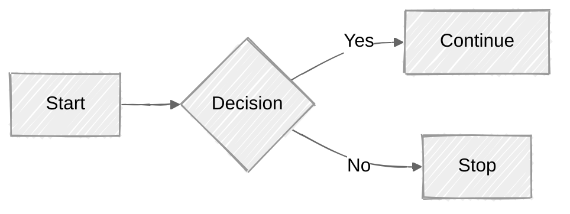

# EtoP Mermaid, Why you should care?
- Mermaid can help documentation catch up with development? how so?
    - Documenting by diagram is costly and time-consuming (outdated quickly), but not having one is worse.
    - Mermaid can help you with that, because it text based, it is easy to update and maintain.
    - It have wide range of integration, from markdown to Jira, Confluence, etc. so you can write it once, and use it in many places.
- Mermaid can help you with your presentation
    - You can use it to create diagrams for your presentation, and it will be easy to update and maintain.
- Feeling drawing diagrams is hard? Mermaid can help you with that
    - It is text based, so you don't need to draw anything, just write the text and it will generate the diagram for you.
- Mermaid is open source, so you can use it for free, and you can contribute to it if you want.
- Mermaid as second brain (any documenting tools can have this advantage)
    - You can use it to create diagrams for your notes, and it will help you to understand and remember the information better.

# Pre-knowledge
- None required

# What is Mermaid?
- Technical
    - Create diagrams and visualizations using text and code
    - It is javascript based
- Non Technical:
    - It won 2019 JS Open Source Awards, as "The most exciting use of technology"

# Concepts
mermaid is compose of 3 main parts:
- Deployment
- Syntax
- Configuration

## Deployment

| Notes: 

## Syntax
- declaration on top of every mermaid diagram, it have 3 parts:
    - `graph type` (required)
    - `TD` (optional, default is `TD`)
    - `LR` (optional, default is `LR`)

- beware of diagram breaking symbols and words:
    - 

| Notes:

## Configuration
- can configure theme

by adding config or metadata like below example, you select a look, below we select handDrawn look, and a theme, below we select neutral theme.

# Example: Getting Started with Mermaid

# Workshop 1: Advanced Mermaid

# Related Tools
- Mermaid Live Editor (Also a great practice area): https://mermaid-js.github.io/mermaid-live-editor/

